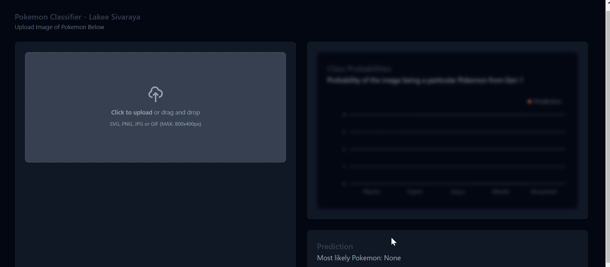

# Pokemon Classification

## Dataset

The dataset consists of images of Gen 1 Pokemon, taken from [Kaggle](https://www.kaggle.com/datasets/lantian773030/pokemonclassification). It consists of around 7000 labeled images of 150 different Pokemon. The images are of varying sizes and aspect ratios, and the Pokemon are in different positions and orientations.

## Model

The ViT transformer model was used to classify this model. Instead of training the model from scratch, a pre-trained model (from google) was used, then fine-tuned on the dataset. Achieving a 0.97 F1 score on the test set.

The trained model is deployed on HuggingFace's model hub, and can be accessed [here](https://huggingface.co/lakeesiv/pokemon)

## Web App

We used the HuggingFace Inference API to classify images of Pokemon using the trained model.
Website URL: [pokemon.lakeesiv.com](https://pokemon.lakeesiv.com/)
